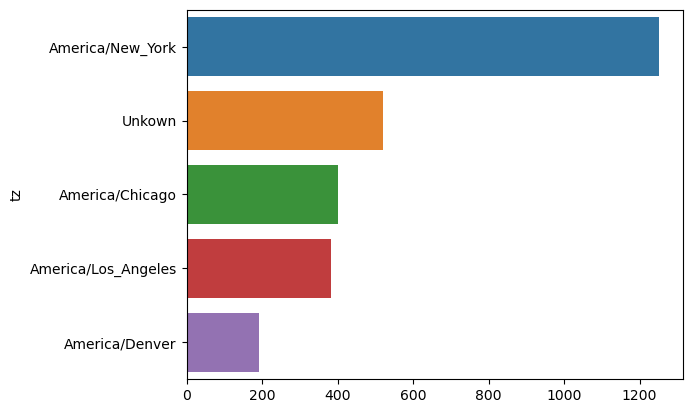
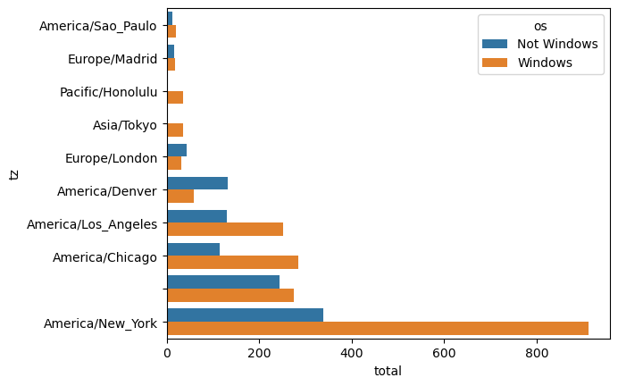
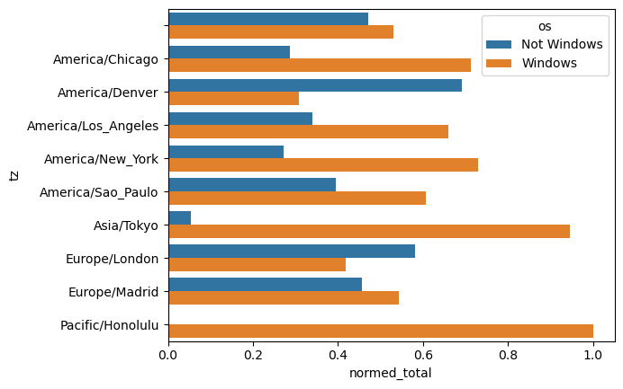

# Bitly data from USA.gov

Example 13.1 in Python for Data Analysis

Loading Data from the [repository](https://github.com/wesm/pydata-book/tree/3rd-edition)


```python
path = "example.txt"

with open(path) as f:
    print(f.readline())
```

    { "a": "Mozilla\/5.0 (Windows NT 6.1; WOW64) AppleWebKit\/535.11 (KHTML, like Gecko) Chrome\/17.0.963.78 Safari\/535.11", "c": "US", "nk": 1, "tz": "America\/New_York", "gr": "MA", "g": "A6qOVH", "h": "wfLQtf", "l": "orofrog", "al": "en-US,en;q=0.8", "hh": "1.usa.gov", "r": "http:\/\/www.facebook.com\/l\/7AQEFzjSi\/1.usa.gov\/wfLQtf", "u": "http:\/\/www.ncbi.nlm.nih.gov\/pubmed\/22415991", "t": 1331923247, "hc": 1331822918, "cy": "Danvers", "ll": [ 42.576698, -70.954903 ] }
    


```python
import json
```


```python
with open(path) as f:
    records = [json.loads(line) for line in f]
records[0]
```


    {'a': 'Mozilla/5.0 (Windows NT 6.1; WOW64) AppleWebKit/535.11 (KHTML, like Gecko) Chrome/17.0.963.78 Safari/535.11',
     'c': 'US',
     'nk': 1,
     'tz': 'America/New_York',
     'gr': 'MA',
     'g': 'A6qOVH',
     'h': 'wfLQtf',
     'l': 'orofrog',
     'al': 'en-US,en;q=0.8',
     'hh': '1.usa.gov',
     'r': 'http://www.facebook.com/l/7AQEFzjSi/1.usa.gov/wfLQtf',
     'u': 'http://www.ncbi.nlm.nih.gov/pubmed/22415991',
     't': 1331923247,
     'hc': 1331822918,
     'cy': 'Danvers',
     'll': [42.576698, -70.954903]}


## Counting time zones in pure python


```python
time_zones = [rec["tz"] for rec in records if "tz" in rec]
```


```python
time_zones[:10]
```


    ['America/New_York',
     'America/Denver',
     'America/New_York',
     'America/Sao_Paulo',
     'America/New_York',
     'America/New_York',
     'Europe/Warsaw',
     '',
     '',
     '']


Leave the empties for now.

Two approaches will be used, first the hard way with standard libraries, then with Pandas


```python
def get_counts(sequence): 
    counts = {}
    for x in sequence: 
        if x in counts: 
            counts[x] += 1
        else: 
            counts[x] = 1
    return counts
    
```

__The same, using defaultdict which will initialize values to 0__


```python
from collections import defaultdict

def get_counts2(sequence): 
    counts = defaultdict(int)
    for x in sequence: 
        counts[x] += 1
    return counts
```


```python
counts = get_counts(time_zones)
```


```python
counts["America/New_York"]
```


    1251


```python
len(time_zones)
```


    3440


Make a sorted list of tuples to find the top 10.


```python
def top_counts(count_dict, n = 10): 
    value_key_pairs = [(count, tz) for tz, count in count_dict.items()]
    value_key_pairs.sort()
    return value_key_pairs[-n:]
```


```python
top_counts(counts)
```


    [(33, 'America/Sao_Paulo'),
     (35, 'Europe/Madrid'),
     (36, 'Pacific/Honolulu'),
     (37, 'Asia/Tokyo'),
     (74, 'Europe/London'),
     (191, 'America/Denver'),
     (382, 'America/Los_Angeles'),
     (400, 'America/Chicago'),
     (521, ''),
     (1251, 'America/New_York')]


__The same, using `collections.Counter`__


```python
from collections import Counter

counts = Counter(time_zones)
counts.most_common(10)
```


    [('America/New_York', 1251),
     ('', 521),
     ('America/Chicago', 400),
     ('America/Los_Angeles', 382),
     ('America/Denver', 191),
     ('Europe/London', 74),
     ('Asia/Tokyo', 37),
     ('Pacific/Honolulu', 36),
     ('Europe/Madrid', 35),
     ('America/Sao_Paulo', 33)]


```python

```


```python
import pandas as pd
```


```python
frame = pd.DataFrame(records)
```


```python
frame.info()
```

    <class 'pandas.core.frame.DataFrame'>
    RangeIndex: 3560 entries, 0 to 3559
    Data columns (total 18 columns):
     #   Column       Non-Null Count  Dtype  
    ---  ------       --------------  -----  
     0   a            3440 non-null   object 
     1   c            2919 non-null   object 
     2   nk           3440 non-null   float64
     3   tz           3440 non-null   object 
     4   gr           2919 non-null   object 
     5   g            3440 non-null   object 
     6   h            3440 non-null   object 
     7   l            3440 non-null   object 
     8   al           3094 non-null   object 
     9   hh           3440 non-null   object 
     10  r            3440 non-null   object 
     11  u            3440 non-null   object 
     12  t            3440 non-null   float64
     13  hc           3440 non-null   float64
     14  cy           2919 non-null   object 
     15  ll           2919 non-null   object 
     16  _heartbeat_  120 non-null    float64
     17  kw           93 non-null     object 
    dtypes: float64(4), object(14)
    memory usage: 500.8+ KB


```python
frame.head(5)
```


<div>
<style scoped>
    .dataframe tbody tr th:only-of-type {
        vertical-align: middle;
    }

    .dataframe tbody tr th {
        vertical-align: top;
    }

    .dataframe thead th {
        text-align: right;
    }
</style>
<table border="1" class="dataframe">
  <thead>
    <tr style="text-align: right;">
      <th></th>
      <th>a</th>
      <th>c</th>
      <th>nk</th>
      <th>tz</th>
      <th>gr</th>
      <th>g</th>
      <th>h</th>
      <th>l</th>
      <th>al</th>
      <th>hh</th>
      <th>r</th>
      <th>u</th>
      <th>t</th>
      <th>hc</th>
      <th>cy</th>
      <th>ll</th>
      <th>_heartbeat_</th>
      <th>kw</th>
    </tr>
  </thead>
  <tbody>
    <tr>
      <th>0</th>
      <td>Mozilla/5.0 (Windows NT 6.1; WOW64) AppleWebKi...</td>
      <td>US</td>
      <td>1.0</td>
      <td>America/New_York</td>
      <td>MA</td>
      <td>A6qOVH</td>
      <td>wfLQtf</td>
      <td>orofrog</td>
      <td>en-US,en;q=0.8</td>
      <td>1.usa.gov</td>
      <td>http://www.facebook.com/l/7AQEFzjSi/1.usa.gov/...</td>
      <td>http://www.ncbi.nlm.nih.gov/pubmed/22415991</td>
      <td>1.331923e+09</td>
      <td>1.331823e+09</td>
      <td>Danvers</td>
      <td>[42.576698, -70.954903]</td>
      <td>NaN</td>
      <td>NaN</td>
    </tr>
    <tr>
      <th>1</th>
      <td>GoogleMaps/RochesterNY</td>
      <td>US</td>
      <td>0.0</td>
      <td>America/Denver</td>
      <td>UT</td>
      <td>mwszkS</td>
      <td>mwszkS</td>
      <td>bitly</td>
      <td>NaN</td>
      <td>j.mp</td>
      <td>http://www.AwareMap.com/</td>
      <td>http://www.monroecounty.gov/etc/911/rss.php</td>
      <td>1.331923e+09</td>
      <td>1.308262e+09</td>
      <td>Provo</td>
      <td>[40.218102, -111.613297]</td>
      <td>NaN</td>
      <td>NaN</td>
    </tr>
    <tr>
      <th>2</th>
      <td>Mozilla/4.0 (compatible; MSIE 8.0; Windows NT ...</td>
      <td>US</td>
      <td>1.0</td>
      <td>America/New_York</td>
      <td>DC</td>
      <td>xxr3Qb</td>
      <td>xxr3Qb</td>
      <td>bitly</td>
      <td>en-US</td>
      <td>1.usa.gov</td>
      <td>http://t.co/03elZC4Q</td>
      <td>http://boxer.senate.gov/en/press/releases/0316...</td>
      <td>1.331923e+09</td>
      <td>1.331920e+09</td>
      <td>Washington</td>
      <td>[38.9007, -77.043098]</td>
      <td>NaN</td>
      <td>NaN</td>
    </tr>
    <tr>
      <th>3</th>
      <td>Mozilla/5.0 (Macintosh; Intel Mac OS X 10_6_8)...</td>
      <td>BR</td>
      <td>0.0</td>
      <td>America/Sao_Paulo</td>
      <td>27</td>
      <td>zCaLwp</td>
      <td>zUtuOu</td>
      <td>alelex88</td>
      <td>pt-br</td>
      <td>1.usa.gov</td>
      <td>direct</td>
      <td>http://apod.nasa.gov/apod/ap120312.html</td>
      <td>1.331923e+09</td>
      <td>1.331923e+09</td>
      <td>Braz</td>
      <td>[-23.549999, -46.616699]</td>
      <td>NaN</td>
      <td>NaN</td>
    </tr>
    <tr>
      <th>4</th>
      <td>Mozilla/5.0 (Windows NT 6.1; WOW64) AppleWebKi...</td>
      <td>US</td>
      <td>0.0</td>
      <td>America/New_York</td>
      <td>MA</td>
      <td>9b6kNl</td>
      <td>9b6kNl</td>
      <td>bitly</td>
      <td>en-US,en;q=0.8</td>
      <td>bit.ly</td>
      <td>http://www.shrewsbury-ma.gov/selco/</td>
      <td>http://www.shrewsbury-ma.gov/egov/gallery/1341...</td>
      <td>1.331923e+09</td>
      <td>1.273672e+09</td>
      <td>Shrewsbury</td>
      <td>[42.286499, -71.714699]</td>
      <td>NaN</td>
      <td>NaN</td>
    </tr>
  </tbody>
</table>
</div>


```python
frame["tz"].head(5)
```


    0     America/New_York
    1       America/Denver
    2     America/New_York
    3    America/Sao_Paulo
    4     America/New_York
    Name: tz, dtype: object


```python
tz_counts = frame["tz"].value_counts()
tz_counts.head()
```


    tz
    America/New_York       1251
                            521
    America/Chicago         400
    America/Los_Angeles     382
    America/Denver          191
    Name: count, dtype: int64


```python
clean_tz = frame["tz"].fillna("Missing")
```


```python
clean_tz.head()
```


    0     America/New_York
    1       America/Denver
    2     America/New_York
    3    America/Sao_Paulo
    4     America/New_York
    Name: tz, dtype: object


```python
clean_tz [clean_tz == ""] = "Unkown"
```


```python
tz_counts = clean_tz.value_counts()
```


```python
tz_counts.head()
```


    tz
    America/New_York       1251
    Unkown                  521
    America/Chicago         400
    America/Los_Angeles     382
    America/Denver          191
    Name: count, dtype: int64


```python
import seaborn as sns
```


```python
subset = tz_counts.head()
sns.barplot(y = subset.index, x=subset.to_numpy(), hue=subset.index)
```


    <Axes: ylabel='tz'>


    

    


```python
frame["a"][1:5]
```


    1                               GoogleMaps/RochesterNY
    2    Mozilla/4.0 (compatible; MSIE 8.0; Windows NT ...
    3    Mozilla/5.0 (Macintosh; Intel Mac OS X 10_6_8)...
    4    Mozilla/5.0 (Windows NT 6.1; WOW64) AppleWebKi...
    Name: a, dtype: object


```python
frame['a'][51][:50]
```


    'Mozilla/5.0 (Linux; U; Android 2.2.2; en-us; LG-P9'


```python
results = pd.Series([x.split()[0] for x in frame["a"].dropna()])
results.head(5)
```


    0               Mozilla/5.0
    1    GoogleMaps/RochesterNY
    2               Mozilla/4.0
    3               Mozilla/5.0
    4               Mozilla/5.0
    dtype: object


```python
results.value_counts().head(8)
```


    Mozilla/5.0                 2594
    Mozilla/4.0                  601
    GoogleMaps/RochesterNY       121
    Opera/9.80                    34
    TEST_INTERNET_AGENT           24
    GoogleProducer                21
    Mozilla/6.0                    5
    BlackBerry8520/5.0.0.681       4
    Name: count, dtype: int64


```python
cframe = frame[frame["a"].notna()].copy()
```


```python
import numpy as np 

cframe["os"] = np.where(cframe["a"].str.contains("Windows"),
                        "Windows", "Not Windows")

```


```python
cframe["os"].head(5)
```


    0        Windows
    1    Not Windows
    2        Windows
    3    Not Windows
    4        Windows
    Name: os, dtype: object


```python
by_tz_os = cframe.groupby(["tz", "os"])
```


```python
agg_counts = by_tz_os.size().unstack().fillna(0)
agg_counts.head(5)
```


<div>
<style scoped>
    .dataframe tbody tr th:only-of-type {
        vertical-align: middle;
    }

    .dataframe tbody tr th {
        vertical-align: top;
    }

    .dataframe thead th {
        text-align: right;
    }
</style>
<table border="1" class="dataframe">
  <thead>
    <tr style="text-align: right;">
      <th>os</th>
      <th>Not Windows</th>
      <th>Windows</th>
    </tr>
    <tr>
      <th>tz</th>
      <th></th>
      <th></th>
    </tr>
  </thead>
  <tbody>
    <tr>
      <th></th>
      <td>245.0</td>
      <td>276.0</td>
    </tr>
    <tr>
      <th>Africa/Cairo</th>
      <td>0.0</td>
      <td>3.0</td>
    </tr>
    <tr>
      <th>Africa/Casablanca</th>
      <td>0.0</td>
      <td>1.0</td>
    </tr>
    <tr>
      <th>Africa/Ceuta</th>
      <td>0.0</td>
      <td>2.0</td>
    </tr>
    <tr>
      <th>Africa/Johannesburg</th>
      <td>0.0</td>
      <td>1.0</td>
    </tr>
  </tbody>
</table>
</div>


`np.argsort()` returns an index of sorted values, eg. [1,3,2] would yield [0,2,1]


```python
indexer = agg_counts.sum("columns").argsort()
```


```python
indexer.values[:10]
```


    array([ 8,  9, 11, 14, 87, 86, 21, 20, 56, 57])


```python
count_subset = agg_counts.take(indexer[-10:])
count_subset
```


<div>
<style scoped>
    .dataframe tbody tr th:only-of-type {
        vertical-align: middle;
    }

    .dataframe tbody tr th {
        vertical-align: top;
    }

    .dataframe thead th {
        text-align: right;
    }
</style>
<table border="1" class="dataframe">
  <thead>
    <tr style="text-align: right;">
      <th>os</th>
      <th>Not Windows</th>
      <th>Windows</th>
    </tr>
    <tr>
      <th>tz</th>
      <th></th>
      <th></th>
    </tr>
  </thead>
  <tbody>
    <tr>
      <th>America/Sao_Paulo</th>
      <td>13.0</td>
      <td>20.0</td>
    </tr>
    <tr>
      <th>Europe/Madrid</th>
      <td>16.0</td>
      <td>19.0</td>
    </tr>
    <tr>
      <th>Pacific/Honolulu</th>
      <td>0.0</td>
      <td>36.0</td>
    </tr>
    <tr>
      <th>Asia/Tokyo</th>
      <td>2.0</td>
      <td>35.0</td>
    </tr>
    <tr>
      <th>Europe/London</th>
      <td>43.0</td>
      <td>31.0</td>
    </tr>
    <tr>
      <th>America/Denver</th>
      <td>132.0</td>
      <td>59.0</td>
    </tr>
    <tr>
      <th>America/Los_Angeles</th>
      <td>130.0</td>
      <td>252.0</td>
    </tr>
    <tr>
      <th>America/Chicago</th>
      <td>115.0</td>
      <td>285.0</td>
    </tr>
    <tr>
      <th></th>
      <td>245.0</td>
      <td>276.0</td>
    </tr>
    <tr>
      <th>America/New_York</th>
      <td>339.0</td>
      <td>912.0</td>
    </tr>
  </tbody>
</table>
</div>


The same, using pandas' `nlargest`.


```python
agg_counts.sum(axis="columns").nlargest(10)
```


    tz
    America/New_York       1251.0
                            521.0
    America/Chicago         400.0
    America/Los_Angeles     382.0
    America/Denver          191.0
    Europe/London            74.0
    Asia/Tokyo               37.0
    Pacific/Honolulu         36.0
    Europe/Madrid            35.0
    America/Sao_Paulo        33.0
    dtype: float64


```python
count_subset.info()
```

    <class 'pandas.core.frame.DataFrame'>
    Index: 10 entries, America/Sao_Paulo to America/New_York
    Data columns (total 2 columns):
     #   Column       Non-Null Count  Dtype  
    ---  ------       --------------  -----  
     0   Not Windows  10 non-null     float64
     1   Windows      10 non-null     float64
    dtypes: float64(2)
    memory usage: 240.0+ bytes


```python
count_subset = count_subset.stack()
```


```python
count_subset.info()
```

    <class 'pandas.core.series.Series'>
    MultiIndex: 20 entries, ('America/Sao_Paulo', 'Not Windows') to ('America/New_York', 'Windows')
    Series name: None
    Non-Null Count  Dtype  
    --------------  -----  
    20 non-null     float64
    dtypes: float64(1)
    memory usage: 790.0+ bytes


```python
count_subset.name = "total"
```


```python
count_subset = count_subset.reset_index()
```


```python
count_subset.head(10)
```


<div>
<style scoped>
    .dataframe tbody tr th:only-of-type {
        vertical-align: middle;
    }

    .dataframe tbody tr th {
        vertical-align: top;
    }

    .dataframe thead th {
        text-align: right;
    }
</style>
<table border="1" class="dataframe">
  <thead>
    <tr style="text-align: right;">
      <th></th>
      <th>tz</th>
      <th>os</th>
      <th>total</th>
    </tr>
  </thead>
  <tbody>
    <tr>
      <th>0</th>
      <td>America/Sao_Paulo</td>
      <td>Not Windows</td>
      <td>13.0</td>
    </tr>
    <tr>
      <th>1</th>
      <td>America/Sao_Paulo</td>
      <td>Windows</td>
      <td>20.0</td>
    </tr>
    <tr>
      <th>2</th>
      <td>Europe/Madrid</td>
      <td>Not Windows</td>
      <td>16.0</td>
    </tr>
    <tr>
      <th>3</th>
      <td>Europe/Madrid</td>
      <td>Windows</td>
      <td>19.0</td>
    </tr>
    <tr>
      <th>4</th>
      <td>Pacific/Honolulu</td>
      <td>Not Windows</td>
      <td>0.0</td>
    </tr>
    <tr>
      <th>5</th>
      <td>Pacific/Honolulu</td>
      <td>Windows</td>
      <td>36.0</td>
    </tr>
    <tr>
      <th>6</th>
      <td>Asia/Tokyo</td>
      <td>Not Windows</td>
      <td>2.0</td>
    </tr>
    <tr>
      <th>7</th>
      <td>Asia/Tokyo</td>
      <td>Windows</td>
      <td>35.0</td>
    </tr>
    <tr>
      <th>8</th>
      <td>Europe/London</td>
      <td>Not Windows</td>
      <td>43.0</td>
    </tr>
    <tr>
      <th>9</th>
      <td>Europe/London</td>
      <td>Windows</td>
      <td>31.0</td>
    </tr>
  </tbody>
</table>
</div>


```python
sns.barplot(x="total", y="tz", hue="os", data=count_subset)
```


    <Axes: xlabel='total', ylabel='tz'>


    

    


__Normalize to show "smaller" ones better.__


```python
def norm_total(group): 
    group["normed_total"] = group["total"] / group["total"].sum()
    return group

results = count_subset.groupby("tz").apply(norm_total)
```

    /tmp/ipykernel_653730/1713748549.py:5: DeprecationWarning: DataFrameGroupBy.apply operated on the grouping columns. This behavior is deprecated, and in a future version of pandas the grouping columns will be excluded from the operation. Either pass `include_groups=False` to exclude the groupings or explicitly select the grouping columns after groupby to silence this warning.
      results = count_subset.groupby("tz").apply(norm_total)


```python
sns.barplot(x="normed_total", y="tz", hue="os", data=results)
```


    <Axes: xlabel='normed_total', ylabel='tz'>


    

    


```python
g = count_subset.groupby("tz")
```


```python
results2 = count_subset["total"] / g["total"].transform("sum")
```
